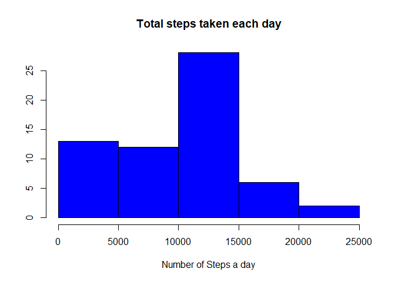
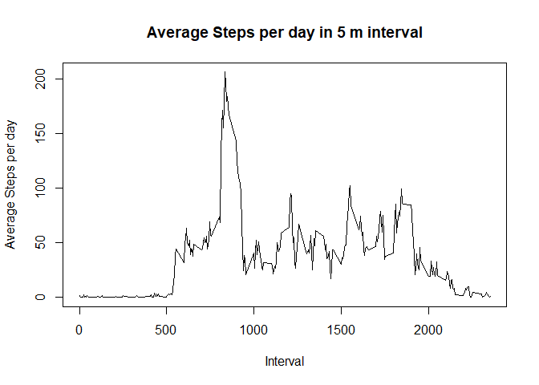
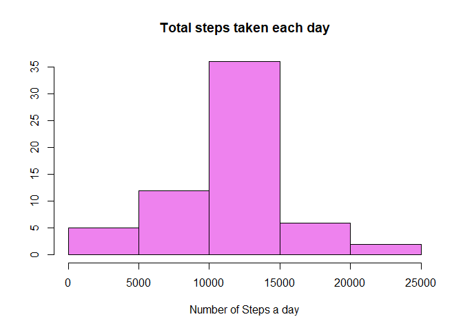
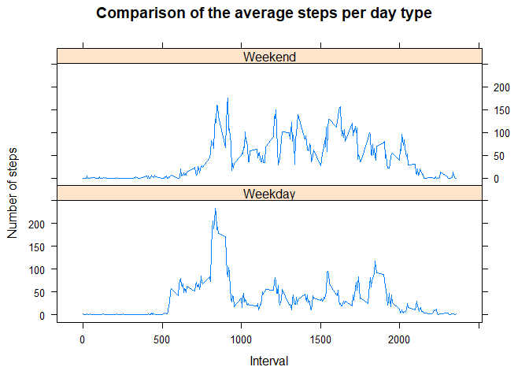

```r
knitr::opts_chunk$set(echo = TRUE)
library(dplyr)
```

```
## 
## Attaching package: 'dplyr'
```

```
## The following objects are masked from 'package:stats':
## 
##     filter, lag
```

```
## The following objects are masked from 'package:base':
## 
##     intersect, setdiff, setequal, union
```

```r
library(lattice)
```

## Loading and prepocessing the data

Opening the data set:


```r
data <- read.csv2("~/R/RSTUDIO/COursera Data Science/Modul 5/Week2/activity.csv", header=TRUE, sep=",")
```
Convert date and time

```r
mydates <- as.Date(data$date, "%y-%m-%d")
```

## What is the mean total number of steps taken per day?

    ###1 - Histogram of total of steps per day


```r
steps_day <- data %>% 
    group_by(date) %>% 
    summarize(Steps=sum(steps, na.rm=TRUE))

head(steps_day)
```

```
## # A tibble: 6 x 2
##   date       Steps
##   <fct>      <int>
## 1 2012-10-01     0
## 2 2012-10-02   126
## 3 2012-10-03 11352
## 4 2012-10-04 12116
## 5 2012-10-05 13294
## 6 2012-10-06 15420
```

```r
hist(steps_day$Steps, main="Total steps taken each day", xlab="Number of Steps a day", ylab= "", col="blue")                 
```

<!-- -->
    
   
    ###2 - Mean and Median of the total number of Steps per Day
    

```r
mean_steps <- mean(steps_day$Steps, na.rm=TRUE)

mean_steps
```

```
## [1] 9354.23
```

```r
median_steps <- median(steps_day$Steps, na.rm=TRUE)

median_steps
```

```
## [1] 10395
```

## What is the average daily activity pattern?

    ###1 - Average number of steps in the 5 min interval
    

```r
steps_interval <- data %>%
  group_by(interval) %>%
  summarise(Steps=mean(steps, na.rm=TRUE))

head(steps_interval)
```

```
## # A tibble: 6 x 2
##   interval  Steps
##      <int>  <dbl>
## 1        0 1.72  
## 2        5 0.340 
## 3       10 0.132 
## 4       15 0.151 
## 5       20 0.0755
## 6       25 2.09
```

```r
plot(steps_interval$interval, steps_interval$Steps, type="l", xlab="Interval", ylab="Average Steps per day", main="Average Steps per day in 5 m interval")
```

<!-- -->
   
   
    ###2 - Interval with maximum number of steps
    

```r
Interval_max_steps <- steps_interval$interval[which.max(steps_interval$Steps)]
Interval_max_steps
```

```
## [1] 835
```
**Interval with the maximum number of Steps:835**


## Imputing missing values

    ###1 - Total of Missing Values
    

```r
Total_rows_na <- sum(is.na(data))
Total_rows_na
```

```
## [1] 2304
```


      
      ###2, 3- Filling in all Missing Values and creating a new data set

```r
data_2 <- data
for (i in 1:nrow(data_2)) {
    if (is.na(data_2$steps[i])) {
        ndx <- which(data_2$interval[i] == steps_interval$interval)
        data_2$steps[i] <- steps_interval[ndx,]$Steps
    }
}
summary(data_2$steps)
```

```
##    Min. 1st Qu.  Median    Mean 3rd Qu.    Max. 
##    0.00    0.00    0.00   37.38   27.00  806.00
```
      
      ### 4 - Making an Histogram of the Total number of steps each day as well as calculatin the Mean and Median
      

```r
steps_day2 <- data_2 %>% 
    group_by(date) %>% 
    summarize(Steps=sum(steps))

head(steps_day2)
```

```
## # A tibble: 6 x 2
##   date        Steps
##   <fct>       <dbl>
## 1 2012-10-01 10766.
## 2 2012-10-02   126 
## 3 2012-10-03 11352 
## 4 2012-10-04 12116 
## 5 2012-10-05 13294 
## 6 2012-10-06 15420
```

```r
hist(steps_day2$Steps, main="Total steps taken each day", xlab="Number of Steps a day", ylab= "", col="violet") 
```

<!-- -->

```r
mean_steps2 <- mean(steps_day2$Steps)

mean_steps2
```

```
## [1] 10766.19
```

```r
median_steps2 <- median(steps_day2$Steps)

median_steps2
```

```
## [1] 10766.19
```


## Are there differences in activity patterns between weekdays and weekends?


      ###1 - Create variable with two levels (weekday and weekend)
      

```r
day <- weekdays(as.Date(data_2$date))
daytype<- vector()
for (i in 1:nrow(data_2)) {
    if (day[i] == "Saturday") {
        daytype[i] <- "Weekend"
    } else if (day[i] == "Sunday") {
        daytype[i] <- "Weekend"
    } else {
        daytype[i] <- "Weekday"
    }
}
data_2$daytype <- daytype
data_2$daytype<- factor(data_2$daytype)
```
      
      ###2 - Panel plot containing a time series plot of the 5m interval and the average number of steps taken, avereged across all weekdays or weekends
      

```r
Average <- aggregate(steps ~ interval + daytype, data=data, mean)
names(Average) <- c("interval", "daytype", "steps")

xyplot(steps ~ interval | daytype, Average, type = "l", layout = c(1, 2), xlab = "Interval", ylab = "Number of steps", main="Comparison of the average steps per day type") 
```

<!-- -->


